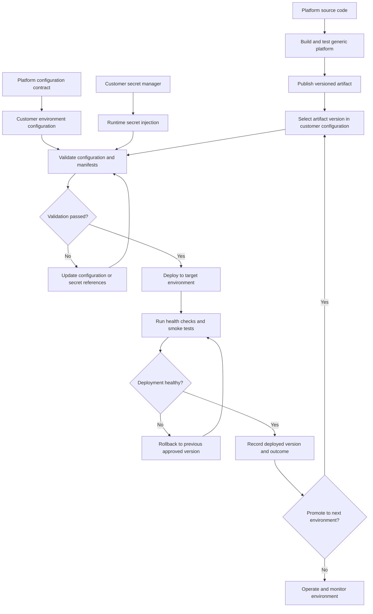

# Customer Environment Configuration Process

## Purpose

This document describes the recommended process for separating the generic platform codebase from customer-specific environment configuration.

The goal is to keep the platform repository reusable and free of customer-specific details, while allowing the customer to manage its own deployment configuration, environment values, access controls, and operational lifecycle within its enterprise source control and delivery tooling.

## Guiding Principles

- The platform codebase should remain generic and portable.
- Customer-specific configuration should be owned and managed inside the customer's enterprise source control.
- Runtime secrets should not be committed to any repository.
- Environment configuration should be explicit, reviewable, versioned, and auditable.
- Deployment automation should inject environment-specific values at build or runtime.
- The same platform release should be deployable into multiple customer environments through configuration only.

## Process Flow



## Repository Separation

The recommended model is to use two distinct areas of ownership.

### Platform Repository

The platform repository contains the product source code and generic local development setup.

It should include:

- Application source code
- Generic local development configuration
- Example environment files with placeholder values
- Configuration schemas or validation rules
- Documentation for required configuration keys
- Generic container and deployment templates where appropriate
- Test fixtures that do not expose customer-specific data
- Build scripts and release process documentation

It should not include:

- Customer-specific URLs, hostnames, tenant IDs, or identity provider aliases
- Customer-specific environment names beyond generic examples
- Customer-specific infrastructure identifiers
- Customer-specific container image names or registry paths
- Production, test, or integration secrets
- Internal customer network details
- Customer-specific deployment targets

### Customer Configuration Repository

The customer configuration repository is created and managed within the customer's enterprise source control environment.

It should include:

- Environment-specific configuration overlays
- Deployment manifests or infrastructure configuration
- Non-secret runtime values for each environment
- References to secrets stored in an approved secret manager
- Customer-specific identity provider configuration
- Customer-specific ingress, callback, and API routing configuration
- CI/CD pipeline definitions or deployment workflows
- Promotion rules between environments
- Operational runbooks and support notes

It should not include:

- Raw passwords, API keys, client secrets, private keys, or tokens
- Unencrypted production credentials
- Unnecessary copies of platform source code
- Hard-coded values that should be supplied by the delivery platform

## Environment Structure

The customer configuration repository should clearly separate each deployment environment.

A typical structure is:

```text
environments/
  local/
  development/
  test/
  staging/
  production/
```

Each environment can contain:

- Runtime configuration values
- Deployment overrides
- Identity provider settings
- Network and ingress settings
- Observability settings
- Feature flags
- Secret references

The exact folder names should match the customer's environment model. The important requirement is that each environment is isolated, reviewable, and independently deployable.

## Configuration Contract

The platform repository should define a clear configuration contract. This contract describes which values the application requires, their purpose, expected format, and whether they are required or optional.

The contract should include:

- Environment variable names
- Required versus optional values
- Default behavior when a value is omitted
- Allowed formats or enumerated values
- Whether the value is secret or non-secret
- Which component consumes the value
- Example placeholder values

The customer configuration repository should then provide the real values for each customer environment.

## Secrets Management

Secrets must be stored in an approved secret management system rather than committed to source control.

Examples of secret material include:

- Client secrets
- API keys
- Database passwords
- Private keys
- Signing keys
- Access tokens
- Service account credentials

The configuration repository should reference secrets by name or path only. The delivery platform should resolve and inject the secret values at runtime.

Recommended controls:

- Use separate secrets per environment.
- Restrict production secret access to approved users and automation identities.
- Rotate secrets according to the customer's security policy.
- Avoid sharing secrets through email, chat, tickets, or documentation.
- Ensure CI/CD logs do not print secret values.

## Identity and Access Configuration

Identity provider configuration should be customer-owned because it depends on the customer's enterprise identity architecture.

The customer configuration repository should manage non-secret identity settings such as:

- Issuer or authority URLs
- Tenant or realm references
- Client identifiers
- Redirect and callback URLs
- Logout URLs
- Required scopes
- Role or group mapping configuration
- Identity provider aliases

Secret identity values, such as client secrets or signing keys, should be stored only in the customer's secret manager.

The platform repository should document the required identity settings without embedding customer-specific values.

## Container Image and Release Flow

The platform build should produce a versioned deployable artifact. The customer deployment process should reference that artifact through configuration.

The process should avoid hard-coding customer-specific image names, registry paths, or deployment targets in the platform repository.

Recommended flow:

1. Platform source code is built and tested.
2. A versioned artifact is produced.
3. The artifact is published to an approved registry or artifact store.
4. The customer configuration repository selects the artifact version for each environment.
5. CI/CD deploys the selected version with the corresponding environment configuration.

Promotion should be explicit. For example, an artifact that has been validated in a lower environment can be promoted to the next environment by updating the version reference in that environment's configuration.

## CI/CD Responsibilities

The platform CI/CD process should focus on validating and packaging the generic application.

Platform CI/CD should typically perform:

- Dependency installation
- Static analysis
- Unit tests
- Build validation
- Container or artifact build
- Security scanning where applicable
- Publishing a versioned artifact

The customer CI/CD process should focus on environment-specific deployment.

Customer CI/CD should typically perform:

- Configuration validation
- Secret reference validation
- Deployment manifest validation
- Artifact version selection
- Deployment to the target environment
- Post-deployment health checks
- Rollback where required

## Configuration Validation

Both repositories should participate in validation.

The platform repository should provide:

- A documented configuration schema
- Example configuration
- Validation scripts or startup checks
- Clear error messages for missing or invalid values

The customer configuration repository should run validation before deployment to confirm that:

- Required values are present
- Values match expected formats
- Secret references exist
- Environment-specific routes and callbacks are valid
- Deployment manifests are syntactically valid

## Environment Promotion

Promotion should be controlled through versioned configuration changes.

A recommended approach is:

1. Deploy a platform artifact version to a lower environment.
2. Validate functionality, authentication, integrations, and monitoring.
3. Raise a reviewed change to promote the same artifact version to the next environment.
4. Deploy using the target environment's configuration.
5. Run smoke tests and health checks.
6. Record the deployed version and deployment outcome.

This ensures that promotion is auditable and does not require changing application source code.

## Rollback Process

Rollback should be planned before production deployment.

The customer configuration repository should support rollback by allowing the deployed artifact version or configuration version to be reverted through a controlled change.

The rollback process should define:

- Who can approve rollback
- How the previous artifact version is selected
- Whether database or schema changes require special handling
- Which health checks confirm recovery
- How incidents are recorded

## Local Development

The platform repository should include a generic local development setup for engineers working on the product.

Local development should use:

- Placeholder configuration
- Local-only services
- Mock or sample integrations where appropriate
- Example environment files
- No customer secrets
- No customer production endpoints

If customer-specific local testing is required, those values should be supplied from the customer configuration repository or from a secure developer onboarding process approved by the customer.

## Data Handling

Customer data should not be copied into the platform repository.

For development and testing, use:

- Synthetic data
- Anonymized data approved for development use
- Mock data
- Contract test fixtures with no sensitive content

Any customer data used outside production should follow the customer's data governance, retention, and access policies.

## Access Control

Access should reflect ownership boundaries.

Platform repository access should be limited to teams responsible for product development and generic release management.

Customer configuration repository access should be managed by the customer and limited to users or automation identities that need to review, approve, or deploy customer-specific configuration.

Production deployment access should be more restricted than lower environment access.

## Change Management

Configuration changes should follow the customer's normal change management process.

Recommended controls:

- Pull request or merge request review
- Required approvals for production changes
- Automated validation before merge
- Clear release notes for deployed artifact versions
- Audit trail for environment changes
- Separation between author and approver where required

## Observability and Operations

The customer configuration repository should include environment-specific observability settings.

This may include:

- Log levels
- Metrics endpoints
- Tracing configuration
- Alert routing
- Health check configuration
- Dashboard references
- Support runbooks

Sensitive observability credentials should be stored in the customer's secret manager.

## Responsibilities

### Platform Team

The platform team is responsible for:

- Maintaining generic application source code
- Defining the configuration contract
- Providing local development examples
- Building and publishing versioned artifacts
- Documenting required runtime settings
- Supporting validation and diagnostics

### Customer Team

The customer team is responsible for:

- Creating and managing the customer configuration repository
- Supplying environment-specific values
- Managing secrets through approved secret stores
- Owning identity provider setup
- Owning deployment approvals and environment access
- Operating production deployments according to internal policy

### Shared Responsibilities

Both teams should collaborate on:

- Configuration contract changes
- Release coordination
- Integration testing
- Incident response
- Security review
- Environment readiness checks

## Onboarding Checklist

Before the first customer deployment:

- Confirm the repository ownership model.
- Create the customer configuration repository.
- Define the environment list and promotion path.
- Document all required configuration values.
- Confirm where runtime secrets will be stored.
- Configure CI/CD permissions and deployment identities.
- Configure identity provider clients and callbacks.
- Define artifact publishing and consumption flow.
- Add validation checks for configuration and deployment manifests.
- Confirm logging, monitoring, and alerting requirements.
- Run a lower-environment deployment.
- Validate authentication and core application workflows.
- Document rollback and support procedures.

## Ongoing Operating Model

For each platform release:

1. The platform team publishes a versioned artifact.
2. Release notes identify configuration changes, migrations, and compatibility notes.
3. The customer team updates the target environment configuration to reference the new version.
4. Automated validation runs against the proposed configuration change.
5. The change is reviewed and approved.
6. CI/CD deploys to the target environment.
7. Health checks and smoke tests confirm the deployment.
8. The deployed version is recorded.

## Summary

The recommended approach is to keep the platform repository generic and reusable, while placing customer-specific deployment and environment configuration in a customer-owned repository. Secrets should remain outside source control and be injected by approved runtime or CI/CD mechanisms.

This creates a clear separation of concerns:

- Platform code is owned and released generically.
- Customer configuration is owned and governed by the customer.
- Secrets are managed by the customer's approved secret management tooling.
- Deployments are repeatable, auditable, and environment-specific.
